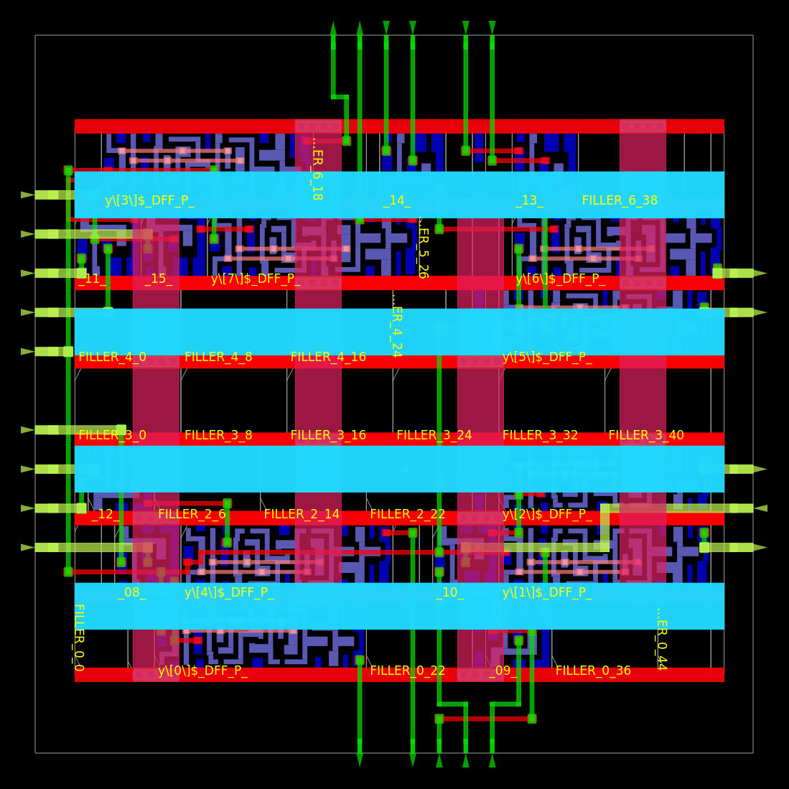
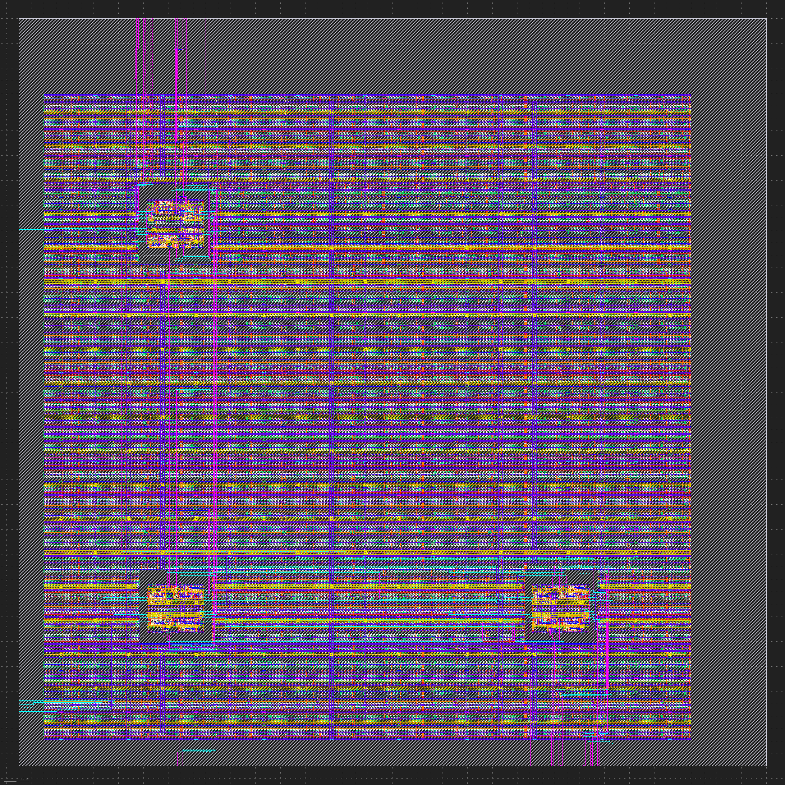

The [actions](https://github.com/philiprbrenan/siliconCompiler_modAInModB/actions)
associated with this repository show how to run [Silicon Compiler](https://docs.siliconcompiler.com/en/latest/index.html) to create
a [module](https://en.wikipedia.org/wiki/Modular_programming) **A**

that is instantiated multiple times in [module](https://en.wikipedia.org/wiki/Modular_programming) **B**.

[Read the full documentation](https://siliconcompiler-modainmodb.readthedocs.io/en/latest/)
